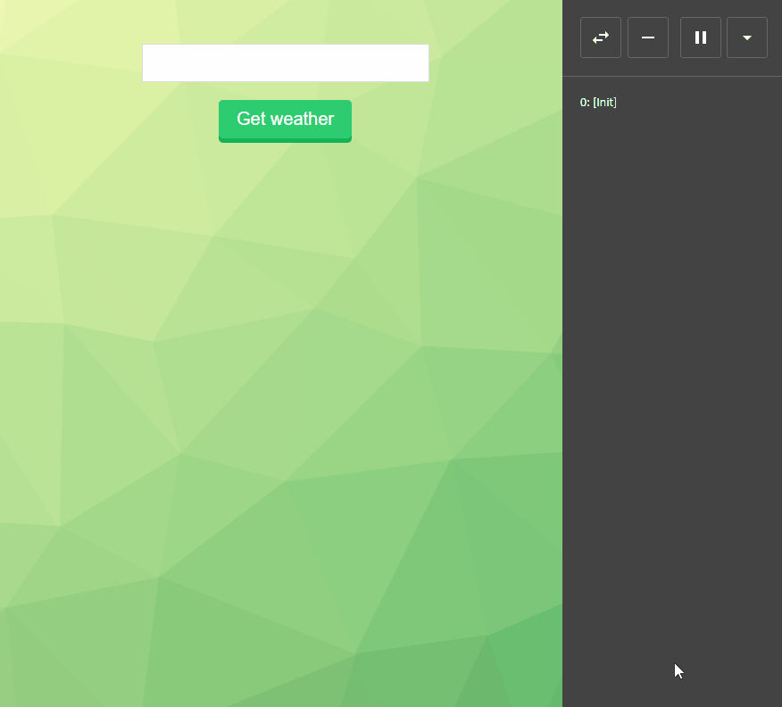

# elm-weather-exercise

A simple Weather app in [Elm](http://elm-lang.org/). 

This app exists to contrast differences between a simple React example vs an Elm example.




### Install:
Clone this repo into a new project folder, e.g. `elm-weather-exercise`, and install its dependencies:
```
git clone https://github.com/guumaster/elm-weather-exercise
cd elm-weather-exercise
npm install
```

If you haven't done so yet, install Elm globally:
```
npm install -g elm
```

Install Elm's dependencies:
```
elm package install
```

### Serve locally:
```
npm start
```
* Access app at `http://localhost:8080/`
* Get coding! The entry point file is `src/elm/Main.elm`
* Browser will refresh automatically on any file changes..


### Build & bundle for prod:
```
npm run build
```

* Files are saved into the `/dist` folder
* To check it, open `dist/index.html`
